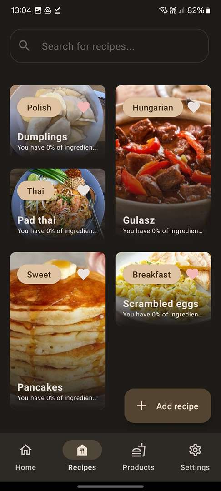
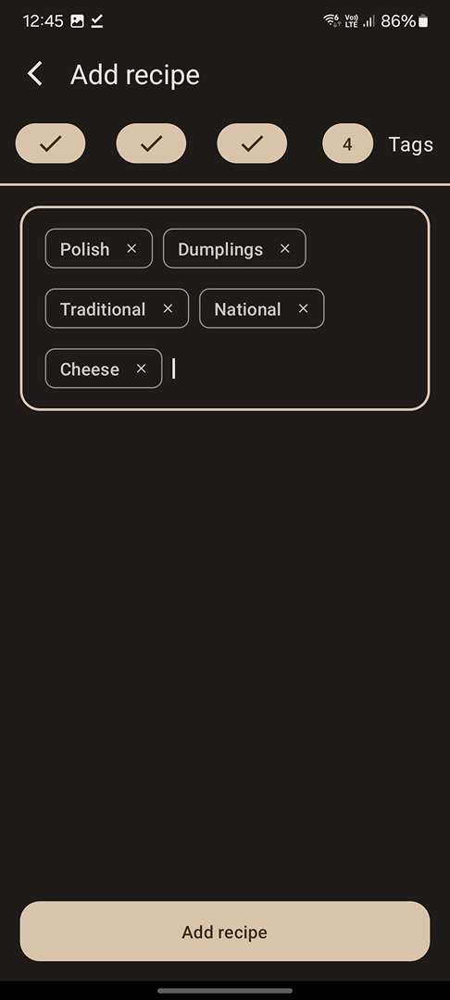
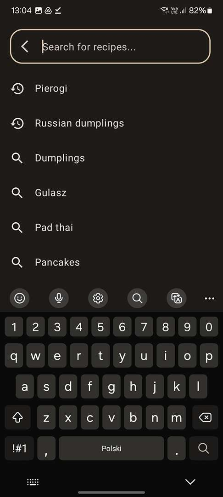

[![Contributors][contributors-shield]][contributors-url]
[![Forks][forks-shield]][forks-url]
[![Stargazers][stars-shield]][stars-url]
[![Issues][issues-shield]][issues-url]
[![MIT License][license-shield]][license-url]
[![LinkedIn][linkedin-shield]][linkedin-url]

<!-- PROJECT LOGO -->
<br />
<div align="center">
<h3 align="center">Freat - Smart Recipe App</h3>

  <p align="center">
    An open-source smart recipe app with features like importing products from recipe scans, calculating and suggesting recipes based on available ingredients.
    <br />
    <a href="https://github.com/MarcelIwanicki/freat"><strong>Explore the docs »</strong></a>
    <br />
    <br />
    <a href="https://github.com/MarcelIwanicki/freat">View Demo</a>
    ·
    <a href="https://github.com/MarcelIwanicki/freat/issues">Report Bug</a>
    ·
    <a href="https://github.com/MarcelIwanicki/freat/issues">Request Feature</a>
  </p>
</div>

<!-- TABLE OF CONTENTS -->
<details>
  <summary>Table of Contents</summary>
  <ol>
    <li>
      <a href="#about-the-project">About The Project</a>
      <ul>
        <li><a href="#built-with">Built With</a></li>
      </ul>
    </li>
    <li>
      <a href="#getting-started">Getting Started</a>
      <ul>
        <li><a href="#prerequisites">Prerequisites</a></li>
        <li><a href="#installation">Installation</a></li>
      </ul>
    </li>
    <li><a href="#usage">Usage</a></li>
    <li><a href="#roadmap">Roadmap</a></li>
    <li><a href="#contributing">Contributing</a></li>
    <li><a href="#license">License</a></li>
    <li><a href="#contact">Contact</a></li>
    <li><a href="#acknowledgments">Acknowledgments</a></li>
  </ol>
</details>

<!-- ABOUT THE PROJECT -->

## About The Project

<br />

<div align="center">
  
</div>

<br />

Freat is an open-source variation of a smart recipe app designed to make cooking easier
and more enjoyable. It allows users to import products from receipt/bill scans, calculates available
ingredients, and suggests recipes based on what's in your kitchen.

Here's why Freat is awesome:

* Smart import of products from receipt/bill scans
* Intelligent calculation and suggestion of recipes based on available ingredients
* Open-source and community-driven development

Feel free to contribute by forking this repo and creating a pull request or opening an issue. Your
feedback and contributions are highly appreciated!

<p align="right">(<a href="#readme-top">back to top</a>)</p>

### Built With

This section should list any major frameworks/libraries used to build your project. Here are a few
examples for a Compose Multiplatform project.

* [![Android][Android-badge]][Android-url]
* [![Kotlin][Kotlin-badge]][Kotlin-url]
* [![SqlDelight][SqlDelight-badge]][SqlDelight-url] SqlDelight
* Compose Multiplatform
* Voyager
* Moko
* Koin
* JUnit
* Turbine

<p align="right">(<a href="#readme-top">back to top</a>)</p>

<!-- GETTING STARTED -->

## Getting Started

This is an example of how you may give instructions on setting up your project locally. To get a
local copy up and running, follow these simple example steps.

### Prerequisites

This is an example of how to list things needed to build and run the app.

* [Android Studio](https://developer.android.com/studio)
* [Kotlin](https://kotlinlang.org/)

### Installation

1. Clone the repo

    ```sh
    git clone https://github.com/MarcelIwanicki/freat.git
    ```

2. Open the project in Android Studio
3. Build and run the app on your Android device or emulator

<p align="right">(<a href="#readme-top">back to top</a>)</p>

<!-- USAGE EXAMPLES -->

## Usage

Use this space to showcase useful examples of how to use the app. You can include screenshots, code
examples, and demos to illustrate its features.

<p align="right">(<a href="#readme-top">back to top</a>)</p>

<!-- ROADMAP -->

## Roadmap

- [x] Smart import of products from receipt scans
- [x] Intelligent calculation and suggestion of recipes
- [x] Integrate project with Bitrise CI/CD
- [x] Material You support
- [x] Cover code with unit tests
- [x] Cover code with UI tests
- [ ] Production ready on iOS
- [ ] Improve recipe scanning algorithm
- [ ] Improve string similarity algorithm
- [ ] Multi-language support
    - [ ] English
    - [ ] Other languages - IN PROGRESS

See the [open issues](https://github.com/MarcelIwanicki/freat/issues) for a full list of
proposed features and known issues.

<p align="right">(<a href="#readme-top">back to top</a>)</p>

<!-- CONTRIBUTING -->

## Contributing

Contributions are welcome! If you have suggestions, enhancements, or bug fixes, please follow these
steps:

1. Fork the Project
2. Create your Feature Branch (`git checkout -b feature/AmazingFeature`)
3. Commit your Changes (`git commit -m 'Add some AmazingFeature'`)
4. Push to the Branch (`git push origin feature/AmazingFeature`)
5. Open a Pull Request

<p align="right">(<a href="#readme-top">back to top</a>)</p>

<!-- LICENSE -->

## Screenshots

<br />

<div align="center">
  
</div>
<br />
<div align="center">
  
</div>
<br />
<div align="center">
  
</div>
<br />
<div align="center">
  
</div>
<br />
<div align="center">
  
</div>
<br />
<div align="center">
  
</div>

<br />

## License

Distributed under the MIT License. See `LICENSE.txt` for more information.

<p align="right">(<a href="#readme-top">back to top</a>)</p>

<!-- CONTACT -->

## Contact

Marcel Iwanicki - [@marcel-iwanicki](https://www.linkedin.com/in/marcel-iwanicki-927895220) -
iwanickimarcel@outlook.com

Project
Link: [https://github.com/MarcelIwanicki/freat](https://github.com/MarcelIwanicki/freat)

<p align="right">(<a href="#readme-top">back to top</a>)</p>

<!-- ACKNOWLEDGMENTS -->

## Acknowledgments

Use this space to give credit to resources that have been helpful. Here are a few to start:

* [Android Developer Documentation](https://developer.android.com)
* [JetBrains Kotlin Documentation](https://kotlinlang.org)
* [Compose Multiplatform Documentation](https://www.jetbrains.com/lp/compose-multiplatform)

[contributors-shield]: https://img.shields.io/github/contributors/MarcelIwanicki/freat.svg?style=for-the-badge

[contributors-url]: https://github.com/MarcelIwanicki/freat/graphs/contributors

[forks-shield]: https://img.shields.io/github/forks/MarcelIwanicki/freat.svg?style=for-the-badge

[forks-url]: https://github.com/MarcelIwanicki/freat/network/members

[stars-shield]: https://img.shields.io/github/stars/MarcelIwanicki/freat.svg?style=for-the-badge

[stars-url]: https://github.com/MarcelIwanicki/freat/stargazers

[issues-shield]: https://img.shields.io/github/issues/MarcelIwanicki/freat.svg?style=for-the-badge

[issues-url]: https://github.com/MarcelIwanicki/freat/issues

[license-shield]: https://img.shields.io/github/license/MarcelIwanicki/freat.svg?style=for-the-badge

[license-url]: https://github.com/MarcelIwanicki/freat/blob/main/LICENSE.txt

[linkedin-shield]: https://img.shields.io/badge/-LinkedIn-black.svg?style=for-the-badge&logo=linkedin&colorB=555

[linkedin-url]: https://www.linkedin.com/in/marcel-iwanicki-927895220

[home-screenshot]: images/home.jpg

[add-photo-screenshot]: images/add_photo.jpg

[add-recipe-screenshot]: images/add_recipe.jpg

[add-tags-screenshot]: images/add_tags.jpg

[products-screenshot]: images/products.jpg

[recipes-screenshot]: images/recipes.jpg

[search-screenshot]: images/search.jpg

[Android-url]:https://developer.android.com

[Android-badge]:https://img.shields.io/badge/Android-3DDC84?style=for-the-badge&logo=android&logoColor=white

[Kotlin-url]:https://kotlinlang.org

[Kotlin-badge]:https://img.shields.io/badge/kotlin-%237F52FF.svg?style=for-the-badge&logo=kotlin&logoColor=white

[Compose-url]:https://www.jetbrains.com/lp/compose-multiplatform

[Compose-badge]:https://img.shields.io/badge/Android-3DDC84?style=for-the-badge&logo=android&logoColor=white

[SqlDelight-url]:https://cashapp.github.io/sqldelight/2.0.1/

[SqlDelight-badge]:https://img.shields.io/badge/sqlite-%2307405e.svg?style=for-the-badge&logo=sqlite&logoColor=white
